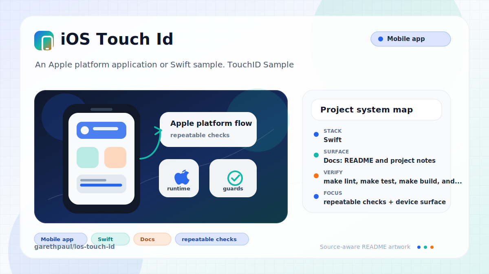

# ios-touch-id

<!-- README-OVERVIEW-IMAGE -->


## Overview

`garethpaul/ios-touch-id` is an Apple platform application or Swift sample. TouchID Sample

This README is based on the checked-in source, manifests, scripts, and repository metadata on the `master` branch. The project language mix found during review was: Swift (3).

## Repository Contents

- `README.md` - project overview and local usage notes
- `CHANGES.md` - recent maintenance changes
- `Makefile` - local static verification entry point
- `build.sh` - Xcode build helper that skips cleanly without Xcode
- `SECURITY.md` - security reporting and disclosure guidance
- `scripts/check-baseline.py` - static LocalAuthentication baseline checks
- `touchid` - source or example code
- `touchid.xcodeproj` - Xcode project file
- `touchidTests` - source or example code
- `VISION.md` - project direction and maintenance guardrails

Additional scan context:

- Source directories: touchid, touchidTests
- Dependency and build manifests: Makefile, build.sh
- Entry points or build surfaces: `make check`, build.sh, touchid.xcodeproj
- Test-looking files: touchidTests/Info.plist, touchidTests/touchidTests.swift

## Getting Started

### Prerequisites

- Git
- Python 3 for static verification with `make check`
- macOS with Xcode for building Apple platform projects

### Setup

```bash
git clone https://github.com/garethpaul/ios-touch-id.git
cd ios-touch-id
make lint
make test
make build
make check
```

The setup commands above are derived from repository files. Legacy mobile, Python, or JavaScript samples may require older SDKs or package versions than a modern workstation uses by default.

## Running or Using the Project

- Open `touchid.xcodeproj` in Xcode, choose the app or sample scheme, and run it on the matching simulator/device.
- Run `./build.sh` when the required platform toolchain is installed. It builds
  the app and XCTest target for the simulator without code signing.

This is a local biometric sample using `LocalAuthentication`. Tap the local
authentication button to start the biometric request. Completion handling fails
closed unless LocalAuthentication reports success with no error. Biometric success
should be treated as a local device signal only, not as server identity proof.
Unavailable biometric hardware and unenrolled biometric states are handled
locally, with failure reason tests covering unavailable Touch ID and missing
errors. The error domain guard keeps unrelated errors on the generic local
failure path. The LocalAuthentication fallback title is hidden because this
sample does not implement a password fallback flow. The in-progress title and
accessibility text describe the local biometric action while authentication is
running without implying remote credential transfer. Accessibility announcements
report local in-progress, success, and failure states without moving focus. The sample does not define
accounts, tokens, networking, uploads, or analytics.

## Testing and Verification

- `make lint`, `make test`, `make build`, and `make check` run
  `scripts/check-baseline.py`, which verifies Xcode project
  wiring, plist/storyboard/asset files, the LocalAuthentication flow, local
  biometric wording, explicit user-triggered authentication, unavailable
  biometric failure reasons, failure reason tests, fail-closed callback result
  normalization, the error domain guard, the hidden fallback title, the
  in-progress title, local authentication
  accessibility text, accessibility announcements, and static privacy
  guardrails.
- The `lint`, `test`, and `build` targets use the same gate. On hosts without
  Xcode they run the static baseline and skip compilation cleanly.
- The pinned GitHub Actions check runs `make check` on `macos-15`. When Xcode is
  available, the gate compiles the Swift 5 app and XCTest target. This hosted
  validation does not invoke LocalAuthentication, access biometric state or
  credentials, launch a simulator, or perform signing.
- Full device verification uses Xcode's test action or
  `xcodebuild test` with the appropriate target and destination on macOS.
- GitHub Actions pins Python 3.12 on macOS before running the same `make check`
  static baseline and unsigned simulator compilation for pushes and pull
  requests. Biometric interaction and device verification remain manual tasks.

When the required SDK or runtime is unavailable, use static checks and source review first, then verify on a machine that has the matching platform toolchain.

## Configuration and Secrets

- No required secret or credential file was identified in the repository scan. If you add integrations later, keep secrets out of git.
- Keep signing material, local `.xcconfig` files, and environment files out of
  git.

## Security and Privacy Notes

- Avoid authentication-state logging. Review all changes to
  `touchid/ViewController.swift` for LocalAuthentication error handling,
  fallback behavior, explicit user-triggered prompts, and local biometric
  privacy.
- Review changes touching authentication or token handling; examples from the scan include touchid/ViewController.swift.
- Review changes touching network requests, sockets, or service endpoints; examples from the scan include touchid/Info.plist, touchidTests/Info.plist.
- Review changes touching file, media, JSON, XML, CSV, OCR, or data parsing; examples from the scan include touchid/Info.plist, touchidTests/Info.plist.

## Maintenance Notes

- This looks like an Apple platform project or sample. Xcode, Swift, CocoaPods, and deployment target versions may need to match the original project era.
- Run `make lint`, `make test`, `make build`, and `make check` before pushing
  changes to Swift sources, project metadata, storyboards, app assets, tests, or
  security documentation.
- See `SECURITY.md` for vulnerability reporting and safe research guidance.
- See `VISION.md` for project direction and contribution guardrails.
- See `docs/plans/2026-06-09-make-gate-aliases.md` for the local gate alias guardrail.
- See `docs/plans/2026-06-09-local-auth-error-domain.md` for the error domain guardrail.
- See `docs/plans/2026-06-09-local-auth-fallback-title.md` for the fallback title guardrail.
- See `docs/plans/2026-06-09-local-auth-accessibility.md` for the local authentication accessibility guardrail.
- See `docs/plans/2026-06-09-local-auth-in-progress-title.md` for the in-progress title guardrail.
- See `docs/plans/2026-06-10-local-auth-accessibility-announcements.md` for the accessibility announcements guardrail.
- See `docs/plans/2026-06-10-ci-baseline.md` for the GitHub Actions Python
  baseline and `docs/plans/2026-06-10-hosted-project-validation.md` for hosted
  Xcode validation.

## Contributing

Keep changes small and tied to the project that is already present in this repository. For code changes, document the toolchain used, avoid committing generated dependency directories or local configuration, and update this README when setup or verification steps change.
